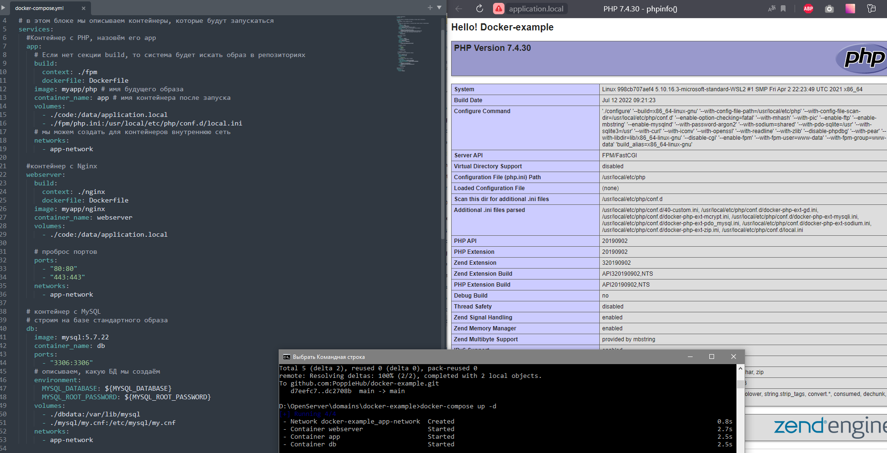

## Площадка для разработки на базе Docker.

----

### Содержание:
1. [Инструкция по развертыванию Docker и базовых команд](./readme/dockerCommands.md)
2. [Информация о контейнерах Docker в данном проекте](./readme/infoContainers.md)

### Детали:
В качестве результата приложен compose файл для воспроизведения контейнеров и скриншот вызова phpinfo через браузер по адресу ***http://application.local***.

#### Скриншот:

LICENSE: [MIT](./readme/license.md)

---

AUTHOR: PoppieHub@GitHub
